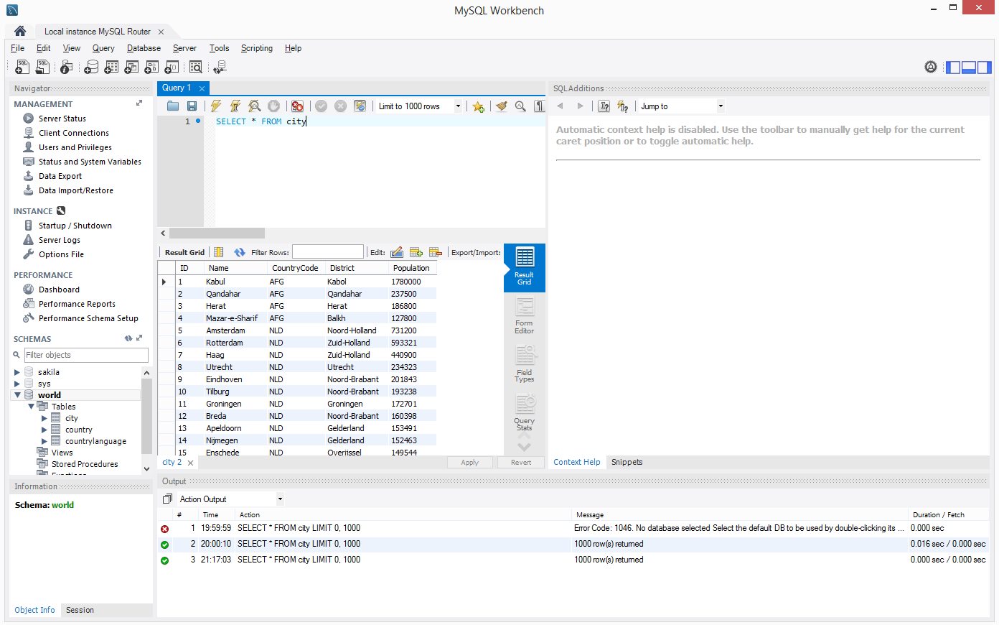

# JDBC POC

This is a proof of concent for connecting to a database with JDBC. The nice thing about JDBC, is that regardless of teh database that you are connecting to, the code is almost entirely the same.

## Dependencies

For starters, you must add the database connector to the maven project dependencies. The following code is for the MySQL connector:

```
<dependency>
    <groupId>mysql</groupId>
    <artifactId>mysql-connector-java</artifactId>
    <version>8.0.12</version>
</dependency>
```

This code is also assuming you are running MySQL locally on a windows machine with a database named world, containing a table named city, with columns: name, district, and population.

To install MySQL on windos, go to: https://dev.mysql.com/downloads/workbench/

However, the code will work with remote databases as-well, you just need to change the connection String from localhost to a valid server.

```
    Connection conn = DriverManager.getConnection("jdbc:mysql://localhost:3306/world?useSSL=false", "USERNAME", "PASSWORD");
```

## Resources:

The following are some useful links to resources that I found helpful:

[Nanyang technological university | singapore](http://www.ntu.edu.sg/home/ehchua/programming/java/jdbc_basic.html)

## Output

Below is an image of the city table in the world database.



A small portion of the output from the JDBCExample code is below. the entire output is pasted in example_output.txt.

```
    The cities selected are:
    Kabul, Kabol, 1780000
    Qandahar, Qandahar, 237500
    Herat, Herat, 186800
    Mazar-e-Sharif, Balkh, 127800
    Amsterdam, Noord-Holland, 731200
    Rotterdam, Zuid-Holland, 593321
    Haag, Zuid-Holland, 440900
    Utrecht, Utrecht, 234323
    Eindhoven, Noord-Brabant, 201843
    Tilburg, Noord-Brabant, 193238
    Groningen, Groningen, 172701
    Breda, Noord-Brabant, 160398
    Apeldoorn, Gelderland, 153491
    Nijmegen, Gelderland, 152463
    Enschede, Overijssel, 149544
    Haarlem, Noord-Holland, 148772
    Almere, Flevoland, 142465
    Arnhem, Gelderland, 138020
    Zaanstad, Noord-Holland, 135621
    ´s-Hertogenbosch, Noord-Brabant, 129170
    Amersfoort, Utrecht, 126270
    Maastricht, Limburg, 122087
    Dordrecht, Zuid-Holland, 119811
    Leiden, Zuid-Holland, 117196
    Haarlemmermeer, Noord-Holland, 110722
    Zoetermeer, Zuid-Holland, 110214
    Emmen, Drenthe, 105853
    Zwolle, Overijssel, 105819
    Ede, Gelderland, 101574
    Delft, Zuid-Holland, 95268
```
